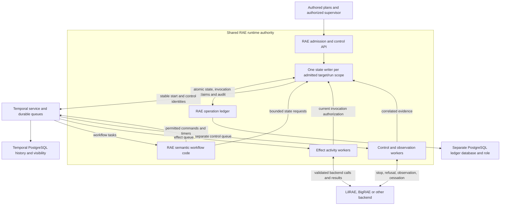

# ADR-113: Reusable Execution Machinery Under RAE Authority

## Status

accepted

## Date

2026-09-23

## Classification

Classification: FM3

Required artifacts: the architecture selection for issue #1350, under
[ADR-104](adr-104-runtime-control-plane-architecture.md) and the
[#1348 supervision semantics](../../../specs/formal/runtime-control-plane/supervision.md).
The existing abstract supervision model supplies the semantic invariants;
the [bounded experiments](../../research/execution-architecture/experiment-report.md)
supply mechanism observations and counterexamples.

Waivers: neither evidence set establishes a distributed refinement proof or
production conformance. This decision selects
components and integration rules; it adds no runtime dependency, published
carrier, selectable profile or executable guarantee. P3 remains unavailable.

## Context

RAE must drive ordinary CTFs, OT digital twins, AI security research and
sandboxes, product tests, and mixed IT/OT disaster recovery without giving each
backend a separate scenario interpreter. The local quickstart is one deployment,
not the product's ceiling. The evaluation's illustrative 15-tenant,
hundreds-of-nodes workload is a design case, not a measured capacity requirement.

The incumbent logical mutation permit spans external calls and cannot provide
the supervision defined by #1348. A new task loop alone would leave RAE building
distributed dispatch, timers, recovery and operational tooling. Conversely,
adopting a framework's success, cancellation or retry semantics as RAE's own
would change authored meaning. The [comparison](../../research/execution-architecture/candidate-comparison.md)
evaluates these trade-offs rather than selecting by framework category.

## Decision

### 1. Reuse execution machinery without transferring responsibility

Select **self-hosted Temporal Server and its Python SDK, backed by PostgreSQL**
for the distributed composition. Use Temporal's durable dispatch, task queues,
workflow history, timers, worker management and replay mechanisms. RAE-owned
code makes the semantic decisions through these mechanisms. Do not build a
replacement durable scheduler, broker, actor platform or workflow language.

Preserve **P0's in-process library composition and P1/P2's existing local
transactional store and ownership boundaries**. Reuse Python/AnyIO concurrency
and SQLite there; do not require a Temporal service for an ordinary local run.
The same RAE semantic functions and contracts serve both compositions, through
small execution adapters. This is not permission to implement two sets of
workflow, retry, time, participant or outcome rules. Selecting remote workers
or PostgreSQL must never silently upgrade a P0/P1/P2 profile.

Temporal Server/SDK and AnyIO use MIT licenses; PostgreSQL uses the PostgreSQL
License; SQLite is public domain. No paid software, managed Temporal service,
enterprise feature or cloud account is required by this architecture. Operating
machines, storage and support still costs resources. Pin supported versions,
transitive licenses, platform compatibility and artifacts through the existing
package/tooling policy when implementation adds dependencies. The experiment
versions are an evidence record, not a production support matrix.

Sources: [Temporal license](https://github.com/temporalio/temporal/blob/main/LICENSE),
[SDK license](https://github.com/temporalio/sdk-python/blob/main/LICENSE),
[AnyIO license](https://github.com/agronholm/anyio/blob/master/LICENSE),
[PostgreSQL license](https://www.postgresql.org/about/licence/),
[SQLite copyright](https://sqlite.org/copyright.html),
[Temporal persistence](https://docs.temporal.io/temporal-service/persistence).

### 2. Keep the ecosystem and runtime boundaries

[Hub #3](https://github.com/OpenRAE/hub/issues/3) and #1348 govern the following
allocation; component reuse cannot alter it.

| Owner | Retained responsibility |
| --- | --- |
| RAES | Semantics, portable contracts and conformance. |
| Shared RAE runtime | Admission, authored execution order and time interpretation, retry/continuation permission, supervised dispatch, conflicting-effect reservations, validated outcomes and requirement satisfaction. |
| LilRAE | Complete personal/local backend: realization, readiness, evidence, rollback and teardown. Its small default pack does not cap capability. |
| BigRAE | Complete organizational backend: organizational control plane, tenancy, authentication, policy, secrets, resource scheduling, audit and operations. These duties do not replace RAE's scenario semantics or operation audit. |
| Hub, Catalog, env-packs | Journey/sequencing/release gate; discoverable reusable assets; bounded environment pack, respectively. |
| Adapters and embedders | Translation only where required; deployment, process lifecycle and selected composition. |

Backends execute concrete effects, establish observations and cessation, and
may legitimately refuse. RAE checks required capability and contextual
willingness, and decides whether the observed result satisfies the admitted
contract. A backend cannot weaken that contract; RAE cannot infer unobserved
reality. Resource availability never supplies permission for another attempt.

### 3. Separate state authority, deterministic orchestration and effect workers

The diagram shows the selected distributed composition, not today's P2 topology.
RAE components may be co-deployed, but external work must not occupy the state
authority's short mutation section or its reserved control capacity.

The ledger is authoritative for portable operations, snapshots, idempotency,
invocation reservations and operational audit. Temporal history is authoritative
for engine progress. These are different facts, with no dual-write success
assumption. Only the scoped RAE state writer commits semantic state, using the
existing atomic-store contract. Effect workers have no direct ledger mutation
credentials. Temporal workflow workers call RAE semantic logic; nondeterministic
store, clock, secret and backend interactions use activities and the admitted
state boundary, never workflow replay code.

Existing workflow and participant schedulers decide *which* work is admissible;
Temporal supplies delivery and execution capacity. BigRAE supplies organizational
resource policy. Do not copy those schedulers into a new queue service.

| Interface | Required information and authority |
| --- | --- |
| Admission to ledger | Immutable actor, target/run, operation kind, validated request commitment, resolved author policy with provenance, contract version and required guarantees. |
| Engine command | Opaque operation/invocation references, expected generation and carrier version; no credentials, live resolver, planner object or pickle. |
| Worker to state authority | Authenticated service identity scoped to tenant, target/run, operation and invocation; current authorization and willingness before effect admission. An engine task token is not RAE authorization. |
| Backend execution/control | Scoped invocation/control identity, admitted constraints, capability/willingness disposition, budgets and correlated evidence. Control has its own authorized actor. |
| Result to state authority | Existing bounded decoding and native validation against a trusted predecessor; effect knowledge, cessation/residual evidence and final release gates where required. |

These are interface obligations, not new wire shapes. Extend the owning
contracts through governed schema publication; current recovery observation
carriers cannot express every cessation, partial-effect or continuation claim.

### 4. Contextual author policy governs failure, retries and fresh trials

Adopt the [retry and scope design](../../research/execution-architecture/authored-retry-policy.md).
Authors can set scenario defaults, nested lexical scope defaults and explicit
local overrides, using the same specificity principle as open/closed scopes.
RAE resolves and validates one effective policy before admission and records its
origin. Capability, idempotency and persistence do not imply permission to retry.
The policy also determines failure response and validity consequences under the
authored context: invalidating an experiment, holding/reconciling a twin's time
and state, invoking an admitted OT safe-state procedure, or restoring an IT
resource are different decisions with different evidence. Neither an IT/OT
label nor a common exception type chooses that response automatically. Mixed
scenarios can select different policies by scope; admission must check their
shared-resource, state and time dependencies. Intentional in-world faults must
not be erased by generic infrastructure recovery.

The choices include never repeating an effect, bounded authorized repetition
under an admitted safety condition, and terminating this trial before separately
admitting a fresh trial. A technically idempotent effect may still be forbidden
to repeat for experimental validity. Reset and compensation require their own
verified obligations. Engine redelivery, effect invocation, authored workflow
attempt and experimental trial are distinct identities and counters.

Engine retries may implement a policy only when each dispatch passes the
current RAE gate and preserves its limits and identity. Otherwise use a
single-attempt effect activity and let RAE schedule a separately authorized
attempt through Temporal. Pure/idempotent bookkeeping can use bounded engine
retries independently. No automatic retry policy applies universally to
in-world effects. In the absence of an authored permission, do not authorize a
second effect; this fallback is not a ban on explicit scoped retry policies.

### 5. Use a conservative ledger/engine protocol

The [execution protocol](../../research/execution-architecture/execution-protocol.md)
specifies admission, start acknowledgement, one-use invocation claims, result
settlement, ownership loss and restore handling. The essential rule is that
replaying a command or recovering an engine never recreates a consumed effect
permission. Resolve ambiguous state commits by authoritative readback; resolve
ambiguous external effects by admitted observation and cessation evidence.

No distributed transaction spans Temporal and the RAE ledger. Reuse PostgreSQL
transactions, uniqueness and revision checks for ledger changes, and Temporal's
stable workflow identity and duplicate-start controls for engine submission.
Do not implement another durable transport queue. A retained admitted command
can be re-submitted for delivery; its effect gate still decides whether an
invocation is permitted. If safe recovery cannot be established, preserve
quarantine and report indeterminacy rather than repeat an uncertain effect.

Distributed owner transfer is conservative: a replacement may observe and
reconcile, but it cannot release the old owner's reservations merely because
its lease expired. PostgreSQL CAS rejects stale state writes; it does not fence
external work. Automatic active/active scope ownership and disconnected
multi-writer operation are excluded from this selection.

### 6. Reserve supervision capacity and retain time authority

Use separate effect and control worker pools and queues, with separately bounded
HTTP/IPC admission, connection pools, audit capacity and process resources.
Bound callbacks, observation, state commits and drain independently; propagate
remaining budgets through nested calls. A shared saturated database or failed
Temporal service remains a common failure boundary. Return bounded unavailable
or indeterminate results there, not successful cancellation. Backend-local
containment and independent emergency controls must be admitted when an authored
interruption guarantee requires them. They do not transfer scenario authority.

Scenario time belongs to the existing clock/domain/segment model. Temporal
timers measure apparatus scheduling, not simulated physics or a paused scenario
clock. RAE maps semantic deadlines explicitly and rechecks the clock segment
and remaining budget on wake/recovery. Persist restart-interpretable time data,
not raw monotonic timestamps. If continuity cannot be established, refuse the
continuation requiring it. Tight control loops and co-simulation stepping belong
in suitable existing backend machinery under the admitted time contract;
Temporal is not a hard-real-time or safety controller.

### 7. Bound federation, isolation, deployment and upgrades

The initial distributed topology has connected trusted workers, one home
authority for each target/run and tenant-scoped services/credentials. Federation
means authorized cooperation between these homes, not shared mutable ownership.
Prefer separate tenant ledger databases/roles, namespaces and worker fleets;
use separate Temporal clusters for mutually distrustful administrative domains.
Namespaces and queue labels route work; authentication and authorization enforce
access. Configure Temporal's supported mTLS/claim-mapping/authorization surfaces;
its default permissive authorizer is unsuitable for untrusted access.
BigRAE owns that deployment policy; RAE still authorizes every operation and
supervisory request. [Temporal security](https://docs.temporal.io/self-hosted-guide/security)

On a partition, a worker that cannot obtain current admission starts no new
effect. An already admitted effect may continue: quarantine the conflicting
scope until observation establishes its outcome. Do not promote another home
or silently fall back to a local profile. Air-gapped deployments can run the
selected services within the enclave or select a supported local composition;
offline multi-writer reconciliation is excluded.

Workers run trusted integration code. Hostile CTF guests, AI-generated code,
models and product-under-test workloads execute behind backend-owned VM,
container or other admitted containment. A Temporal workflow sandbox is a
determinism mechanism, not that security boundary. Keep control/store credentials
outside those workloads. Validate sizes and types before SDK decoding reaches
domain consumers; reuse JSON ingress, closed carriers, environment bindings,
participant information-flow/final-sink checks and value-free error envelopes.
Use configured endpoints only. Secret references are resolved at authorized
execution; raw secrets stay out of history, search attributes, heartbeat data,
retry records, dashboards and audit. Stored outputs also obey disclosure policy.

Deploy the service, its supported PostgreSQL persistence and visibility stores,
RAE's separate ledger, trusted workers and existing host supervision. A separate
search cluster or Kubernetes installation is not required by this decision.
Apply existing artifact locks, least-privilege roles, backups and restore drills.
Keep compatible workflow workers available for old histories; use supported
versioning and Continue-As-New at validated boundaries, carrying operation
identity, policy, remaining budgets, reservations and pending controls. History
rollover is not a new RAE attempt or trial. Refuse unsupported versions rather
than replay changed semantics. See [versioning](https://docs.temporal.io/develop/python/versioning)
and [Continue-As-New](https://docs.temporal.io/develop/python/continue-as-new).

### 8. Keep the use cases broad

| Use case | Composition and semantic requirement |
| --- | --- |
| Ordinary CTF | Small local profile or shared distributed deployment as needed; bounded setup/reset/teardown and optional retry defaults. No compulsory robotics, experiment wrapper or physical-OT safety stack. |
| OT digital twin | Existing simulation/plant-model backend, explicit time/fidelity/coupling contract and evidence. SimPy can schedule discrete events; it is not a physics solver or a universal twin. ROS actions are useful only where that backend already uses them. |
| AI security and sandboxes | Isolate hostile workloads from trusted workers, protect participant disclosure, preserve model/data/tool versions and trial identity. Ray may serve a backend's distributed compute need without owning RAE outcomes. |
| Product testing | Reuse the product's test/provisioning machinery at backend seams; preserve scenario assertions, reset evidence and exact policy. A flaky-test retry must remain visible; idempotency cannot turn a failed trial into an unreported retry. |
| Mixed IT/OT disaster recovery | Execute authored restoration dependencies and verify recovery through backend observations. Restoring orchestration records does not restore the world. Physical-state reconciliation, backend refusal and separate safety systems remain explicit; no universal rollback or safety certification is claimed. |

### 9. Acceptance and implementation boundary

The architecture selection is complete; its executable realization follows
governed contracts and tests. [#1360](https://github.com/OpenRAE/rae/issues/1360)
and [#1362](https://github.com/OpenRAE/rae/issues/1362) must consume the interface,
retry-policy and recovery obligations. Public authoring of inherited retry
defaults, their compilation and the fresh-trial link require explicit delivery;
they are not features of today's cleanup-policy carrier. A coordinated profile
additionally needs an API-404-C4 ADR/formal-model extension and tenant/owner
conformance before P3 can become selectable. This ADR does not make that change.

The [canonical disposition](../../research/execution-architecture/decision-discussion.md)
maps API-404 C1-C4 and the retained workflow, time, trial, result-validation and
observability owners. API-404 remains ACTIVE for its existing guarantees. Design
and probe evidence is recorded as DOCUMENTS, without new fulfillment claims.

Before deployment claims, verify the actual RAE/backend composition under
duplicate delivery, stale workers, lost commit acknowledgements, service/store
loss, saturated control paths, unauthorized messages, secret-bearing history,
code upgrades and independent backup restores. Test policy inheritance and
fresh-trial validity, not just Temporal status. Measure load using event rates,
payloads, durations and control latency; tenant/node counts do not size a system.

## Alternatives Considered

- **DBOS with PostgreSQL:** a credible free durable-workflow alternative with
  distributed queues. Its probes do not show it incapable. Temporal is selected
  for its explicit service/worker separation and integrated execution history,
  routing and operational model across connected worker fleets. DBOS's embedded
  model reduces service footprint; changing this selection needs new evidence
  that the operational trade-off matters, not another general survey.
- **Celery/task queues or a custom AnyIO platform:** mature task delivery is
  useful, but building durable scenario orchestration, recovery coordination and
  history around a task queue leaves more generic machinery for RAE to maintain.
  Keep AnyIO for the local/worker seam. Do not create a second distributed engine.
- **ROS actions, Ray actors, SimPy, BehaviorTree.CPP:** retain as complementary
  backend mechanisms where required. None supplies the complete portable
  operation contract, and no evidence justifies making all users install them.
- **One mandatory distributed service:** violates the local composition promise.
  **Engine history as the operation ledger:** conflates execution and semantic
  outcomes and loses the existing atomic snapshot/operation/audit boundary.

## Consequences

RAE reuses established free execution and storage components while retaining
its duties. Integration work remains: semantic adapters, governed invocation
carriers, PostgreSQL store/provider, authenticated workers and policy compilation.
These are domain boundaries, not a new general-purpose execution platform.

The distributed deployment is heavier than local SQLite and requires database,
service, worker-version and backup operations. Conservative reconciliation can
leave scopes unavailable when effects cannot be observed. That loss of liveness
is explicit; framework restart cannot manufacture permission or cessation.
