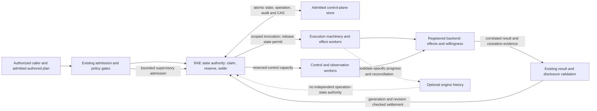

# Issue 1350 — Execution Architecture Preflight

Date: 2026-09-23. Status: preflight guidance; no executor, dependency, or
architecture has been accepted here. Issue #1350 is the contract for the later
decision. Its prerequisite is the [#1348 decision](issue-1348-operation-lifecycle.md),
[ADR-104](adrs/adr-104-runtime-control-plane-architecture.md), and the
[supervision semantics](../../specs/formal/runtime-control-plane/supervision.md).
The issue's historical [research](https://github.com/OpenRAE/rae/blob/077f7d04/docs/research/runtime-refactor/research.md)
and [diagnosis](https://github.com/OpenRAE/rae/blob/077f7d04/docs/research/runtime-refactor/diagnosis.md)
are available at the pinned Git revision, not in this branch's working tree.
Their candidate list is exploratory, not an adoption decision.

Subsequent selection: [ADR-113](adrs/adr-113-reusable-execution-machinery.md)
records the accepted decision. This preflight retains the constraints used to
evaluate it; statements about pending selection below describe preflight state.

The existing [candidate evaluation](../research/execution-architecture/README.md)
and [decision discussion](../research/execution-architecture/decision-discussion.md)
are also exploratory; their Temporal/PostgreSQL recommendation is not accepted.
This preflight neither repeats those experiments nor selects their proposal.
The supplied #1350 issue assigns [API-404](../requirements/API-404/requirement.md).
Its C1–C4 clauses and runtime profile catalog constrain the selection; this note
is design guidance, not implementation evidence or a fulfillment claim. Related
requirements retain the dispositions recorded by #1348.

## Decision boundary

The selected machinery must implement the existing operation contract, not
become its semantic owner. RAE owns admission, one state writer, supervised
dispatch, conflicting-effect reservations, result validation, atomic terminal
publication, and honest recovery classification. Authored workflow, time,
attempt, compensation, cleanup, and trial rules decide what work is permitted.
Backends own concrete effects, contextual willingness, interruption and effect
observation. Embedders own process deployment. A control receipt, durable
checkpoint, process death, timeout, or store lease is not evidence that remote
effects stopped. P0 must remain an in-process library composition; P1/P2 keep
their declared persistence and single-worker boundaries; P3 is unavailable.

[Hub #3](https://github.com/OpenRAE/hub/issues/3) assigns complete local and
organizational backend responsibilities to LilRAE and BigRAE; the #1348 decision
establishes their shared RAE runtime. RAE retains authority over what must happen,
when and why. Backend resource scheduling, realization, observations and
contextual limits remain backend authority. Cooperation, including legitimate
refusal, is expected. These responsibilities cannot be traded for easier upkeep.

Reusable machinery may implement substantial runtime logic while RAE retains
these duties. Evaluate complete compositions, with explicit handling of their
inevitable limits. The scope of reuse need not be restricted in advance to a
worker adapter. These are candidate claims to test, not accepted choices:

The existing decision discussion assumes 15 federated tenants, hundreds of
nodes and tens of agents per scenario; these counts are not capacity evidence.
Preserve local profile compatibility without treating it as a platform ceiling.
If distributed execution is selected, evaluate mature execution components
before constructing equivalent infrastructure from concurrency primitives.
API-404's missing coordinated/tenant guarantees require explicit design and
contract extensions; neither that deployment scope nor its fulfillment follows
from the issue's requirement assignment or a library choice.

| Pattern and concrete seam | Useful guarantee from the candidate | Limitation against #1348; deployment/failure boundary |
| --- | --- | --- |
| Incumbent Python/AnyIO worker and bounded HTTP offload, with a short state-owner section | Already composes the core, HTTP adapter, and in-memory/SQLite stores without another service. | Current logical mutation permit spans backend work; `_ControlPlaneCallExecutor` and runtime close drain indefinitely. Read, audit and mutation paths all use `run_in_threadpool`; separate methods do not reserve control capacity. Thread cancellation cannot stop a blocked callback. A process crash loses P0 work; P1/P2 need startup reconciliation. This is a comparison baseline, not proof that a new event loop is needed. |
| Durable execution: [Temporal](https://docs.temporal.io/activity-execution) or [DBOS](https://docs.dbos.dev/architecture), implementing runtime orchestration and backend tasks | Reuse durable execution records, scheduling, queues and worker recovery. Runtime-owned code specifies the semantic decisions using engine APIs. | Recovery must obey authored retry/observation rules; cancellation still requires backend cooperation. Temporal adds a service and persistence; DBOS Python supports SQLite or Postgres. Distinguish engine progress from portable operation state and specify their reconciliation. Evaluate complete compositions, not only per-operation opt-in. |
| Robotics/action protocol, e.g. [ROS 2 actions](https://design.ros2.org/articles/actions.html), at a backend adapter | Goal acceptance, feedback, result and a distinct cancel request are useful for a backend that already exposes them. | Action `CANCELING`/`CANCELED` are not RAE operation states or independent effect/cessation proof. Middleware, executor and backend deployment are extra dependencies; no ROS stack is required of non-robotic backends. Mapping must validate correlated backend evidence, not copy ROS states into portable DTOs. |
| Simulation/event scheduler, e.g. [SimPy events](https://simpy.readthedocs.io/en/4.1.1/api_reference/simpy.events.html), at semantic-time scheduling | Deterministic event ordering and cooperative process interrupts can serve a simulation backend. | A SimPy interrupt is delivered to its process, not to a blocked native/remote call. Its clock cannot replace the authored time-domain authority or apparatus monotonic deadline; no durable external-effect recovery follows from the event queue. |
| Actor mailbox/supervision, e.g. [Akka typed supervision](https://doc.akka.io/libraries/akka-core/current/typed/fault-tolerance.html), or a small in-process serialized owner | Mailbox serialization and explicit stop/restart policies can isolate local failures. | Mailbox saturation can strand urgent supervision; restarting an actor can abandon an active external effect. A separate framework/runtime adds ownership and deployment complexity. Reuse only if it preserves the existing store writer, reserved control capacity and quarantine; actor restart is not operation retry. |

Behavior trees, statecharts, game loops and reconciliation controllers may help
particular authored or backend-local control, but none by itself supplies the
operation store, effect fencing, or authorization boundary. A desired-state
reconciler that re-applies effects is especially unsafe after an indeterminate
result. Mapping authored workflow states into engine steps must preserve their
meaning and permissions, including after recovery.

The following is the required logical boundary from #1348, not a selected
framework, new public interface, or claim about today's executable supervision:

RAE retains the effect reservation while the state permit is free. Workers have
no direct store-write authority. Engine history, if present, is an additional
failure and disclosure boundary; the diagram asserts no atomic transaction
between it and the RAE store.

## Existing interfaces and whole-repo gates

Python package paths below are relative to `implementations/python/packages/`;
unqualified module names refer to `raes_runtime`.

| Layer | Canonical incumbent and required fit |
| --- | --- |
| Contracts and semantic validation | `raes_contracts/operation_lifecycle.py`, `raes_contracts/contracts/operation_carriers.py`, closed `ContractModel` carriers, the FM3 model, authored `raes_contracts/workflow/`, `TimeCoordinator`, and SCE-007 trial/attempt/cleanup models own states, identities and permission. Reuse the SDL parser/compiler, plan admission and `backend_input_contracts.py` before dispatch, and native workflow/result/time validators on return. An executor gets an admitted command, not an alternate schema or validation policy. |
| Component admission | `ControlPlaneOptions`/`ControlPlaneConfiguration`, `control_plane_profiles.py`, `RuntimeTarget`, registry shape checks, `registry_target_validation.py`, and backend manifests distinguish profile, installed component, operation-kind support and contextual willingness. If a candidate needs an optional worker or backend control method, declare and shape-check it here; recheck willingness after queueing. No implicit profile upgrade or fallback. |
| State and persistence | `RuntimeMutationAuthority`, `RuntimeLifecycleMixin`, `RuntimeDurabilityMixin`, `ControlPlaneStore`/`AtomicControlPlaneStore`, `ControlPlaneStoreCommitAdapter`, in-memory and SQLite stores, revision CAS, strict codecs/migrations, `RuntimeOwnerLease` and path hardening own claim, readback, quarantine, audit and publication. A scheduler must neither hold the state permit across a callback nor release the effect reservation on local timeout. Engine history governs execution progress; its reconciliation with RAE operation records must preserve one semantic authority. Distributed storage and owner fencing need explicit contract extensions. |
| Backend and failure isolation | `backend_calls.py`, `_validated_backend_result()`, `backend_result_diagnostics.py`, `control_plane_recovery.py` and recovery observer own isolated inputs, trusted predecessor and recovery classification. Extend late-result admission through those boundaries; workers need scoped invocation/generation identities. Failure or malformed return must preserve portable state without claiming absent effects. Reserve target/run-wide conflicting effects unless admitted independence proves narrower isolation. |
| Security and HTTP validation | `ControlPlaneSecurityConfig.strict_defaults()`, `_ControlPlaneApiAuth`, `ControlPlaneIdentity`, `control_plane_plan_authorization.py`, `operation_admission_context()`, `RequestSizeLimitMiddleware`, API Pydantic models and bounded `_ControlPlaneCallExecutor` are the gates. Any new control route reauthorizes target/run/subject and operation scope, records its own supervisor actor, and retains bounded admission even when effect workers are saturated. IDs, receipts and engine task tokens do not authorize a RAE operation; protect engine tokens according to their native privileges too. |
| Secrets and host exposure | `SecretReferenceId`, runtime fact binding/dispatch, `raes/runtime_environment.py`, stateful resource projections and planner admission own closed env shapes, freshness, sensitivity and scoped resolution. Keep resolved credentials ephemeral, out of checkpoints, logs, audit, HTTP errors and worker payloads unless an existing validated carrier permits them. No token in process argv, inherited broad environment, request-supplied command or new shell boundary. TLS, proxy header stripping, filesystem permissions and process supervision stay with the embedder. A local process kill does not fence a remote job. |
| Observability and error envelopes | Existing `Diagnostic`/`DiagnosticModel`, `portable_diagnostic_payload()`, `AuditEvent`, rejection audit, module loggers, `control_plane_health.py`, API `_conflict_detail()` and `_operation_routes.py`'s global 422/500 handlers own value-free diagnostics and redacted responses. Keep operational readiness, participant observations, workflow history and experiment evidence distinct. Preserve denial status and headers if audit fails. Do not surface native exception text, request input, paths, credentials, traceback or engine payloads. |
| Participant scheduling and disclosure | `participant_scheduler_concurrency.py`, `participant_scheduler_concurrent_dispatch.py`, `participant_resource_budgets.py` and `participant_resource_reservation.py` already admit bounded batches, semantic independence and shared resource use. Preserve their accounting, ordering and indeterminate settlement instead of adding a competing scheduler. `participant_crossing_*`, `participant_control_*`, `participant_opacity_enforcement.py` and `participant_flow_sink.py` retain selected actor/subject, state-cut and final-sink checks before effects or disclosure. An engine's serialization/history is an additional disclosure boundary, not a reason to bypass these checks. |
| Package and deployment boundaries | ADR-036 and `tools/policy/adr_policy.yaml` own imports: backend protocols depend on contracts; runtime must not import concrete backend, CLI or MCP packages; MCP is an authoring surface. Keep engine-specific SDK objects out of portable contracts and lower layers. Runtime dependencies belong in `implementations/python/pyproject.toml` and its `uv.lock`; experiment tooling is distinct from shipped dependencies. Development executables/images use ADR-106, `implementations/tooling/artifacts.lock.json` and `tools/check_tooling_artifact_policy.py`. Record license, supported Python/OS versions, service/storage versions, migration, backup/restore and worker drain obligations before adoption. |
| Publication and verification | `.ground-control.yaml`, `.gc/plan-rules.md`, `noxfile.py`, repo policy, ADR-059 pins, requirement governance, and ADR-009/061 schema manifest and `schema_bundle()` are the gates. A portable carrier change needs its published schema, ledger, compatibility checks and strict migration together. Local verification stays targeted; CI owns full suites. |

At a new serialized worker boundary, reuse `raes_contracts/json_ingress.py`
for bounded, duplicate-rejecting, finite JSON parsing before closed
`ContractModel` validation; preserve `runtime_value_limits.py` aggregate bounds
and domain validators. SDK deserialization or a matching Python type alone is
insufficient. Revalidation across a trust boundary is necessary; duplicating
the schema or its validation rules in an engine DTO is not. Translate SDK
failures at the adapter into the existing diagnostic/conflict vocabulary without
losing the distinction between denied admission, uncertain effects and uncertain
store acknowledgement. SDK failures must not leak through logs or error causes.

Environment binding must pass **both** `raes/runtime_environment.py` and
`raes_processor/planner/stateful_admission.py`: literal `value` and `value_from`
are exclusive; generated output cannot claim `operator_secret`; delivery mode,
exact projection keys, node/output identity, sensitivity and consumer match must
agree. Reuse `raes_processor/planner/prepared_node_projection.py` and
`raes_runtime/backend_account_credentials.py` on the result path. A generic
engine environment dictionary cannot replace these shapes. Reuse
`runtime_fact_binding_policy.py` and `RuntimeFactDispatchCommand` for scoped,
fresh, protected-sink resolution; their in-process one-shot object is not a
durable deduplication record. Service connection credentials are embedder
configuration, not authored scenario environment.
Keep durable tasks reference-based and resolve credentials at the authorized
execution boundary; include engine history, search attributes, heartbeat data,
retry/dead-letter records and dashboards in the disclosure review. Redacting the
HTTP response alone does not protect those sinks.

Connection endpoints must come from trusted composition, not an authored plan
or worker message. Reuse `raes_contracts/uri_safety.py` for portable URI fields;
its rejection of embedded credentials is not network authorization, TLS
verification or an SSRF defense. Selected clients still need authenticated
endpoints and explicit deployment trust. Child workers must not inherit owner
lease/store handles, broad credentials or live resolver objects. Process
isolation needs bounded IPC, explicit resource limits and owned shutdown; it
does not make hostile backend code safe or contain remote effects.

The dependency seam must be parameterized by **operation kind and admitted
guarantees**, with a typed worker/backend capability and per-invocation control
identity. This lets a future backend offer cooperative stop, observation or
continuation without forcing every P0 backend to install an execution service.
Operational queue, callback, observation, commit and drain budgets belong in
typed runtime configuration; authored semantic time remains with its existing
clock/domain/segment model. Version any durable command or evidence carrier
through the contract publication rules, and define upgrade behavior before
using framework checkpoints for recovery.

The current `RecoveryObservationResult` carries absent/applied/indeterminate
classification; it does not establish general partial-effect, cessation or
continuation evidence. Extend its owning contracts through governed publication
where required; do not hide stronger claims in diagnostics or engine status.

The exact credential-sensitive retry proof in `control_plane_operation_context.py`
and `control_plane_admission.py` is deliberately ephemeral. A public request
commitment after restart cannot reauthorize credential-bearing input or supply
replay material. `RuntimeManager` is a separate direct-execution facade; it
cannot dispatch into a target/run quarantined by the control plane.

## Open boundaries for a distributed composition

These obligations apply to any candidate, including the existing proposal; they
are decision constraints, not a delivery sequence or a new protocol definition.

- **Admission across a worker boundary.** The current trusted-embedder identity,
  process-local planner digest registration and injected resolver/service objects
  are not portable authorization. Define how a worker establishes the admitted
  operation, actor, target/run, generation and current authority before an effect.
  Do not pickle a live control plane, resolver, callback or mutable snapshot to
  preserve process-local trust. Reuse bounded contract decoding and native result
  validators on return. Unsupported carrier/worker versions fail closed.
- **Ledger and execution history.** Account for loss between claim, enqueue,
  invocation, effect, result receipt, terminal commit and engine acknowledgement.
  Preserve one semantic writer and atomic snapshot/operation/audit publication;
  no shared database name implies a transaction across two systems. Duplicated
  or out-of-order delivery must resolve through the admitted identity and
  authoritative readback without another invocation or rewritten terminal parent.
  Retention, restore and worker upgrades must preserve deduplication and the
  evidence needed to reconcile still-active effects; history expiry is not
  permission to repeat them.
- **Replay and identity.** Distinguish an engine workflow/run/task/attempt from
  a RAE operation, execution generation, authored workflow attempt and trial
  `run_id`. Engine reset, retry, continuation, signal redelivery or manual
  redrive cannot allocate a fresh effect permission. Deterministic orchestration
  must not directly call mutable stores, clocks, secret resolvers or backends;
  map those interactions through the selected engine's supported boundary and
  existing RAE admission. A replayed permission or willingness result is
  historical evidence, not current dispatch authority. Code upgrades and
  history rollover must retain operation identity, remaining budgets,
  reservations and pending supervision without re-executing effects.
- **Ownership and federation.** `RuntimeOwnerLease`, its process/fork checks,
  `require_single_worker_configuration()` and local private store paths remain
  the P1/P2 boundary. A remote store or worker fleet needs explicit scope binding,
  ownership transfer, stale-worker handling and partition behavior before it can
  claim coordination. Tenant/namespace/queue names are routing labels, not access
  control. Define authenticated service/worker identities, least-privilege store
  and secret access, trust and credential revocation, and authorization of
  callbacks/observations. Neither owner CAS nor a network partition proves that
  the previous worker or backend stopped; retain exclusion when that is unknown.
- **Bounded operation.** State how effect, control, audit and store capacity stay
  available under saturation and service failure. Separate queues alone do not
  isolate shared thread pools, database connections, locks, CPU or memory. Reuse
  resource accounting, require finite stage budgets, and preserve remaining
  budgets across nested calls; scenario pause cannot pause supervision. Scope
  endpoint, queue and worker settings to the selected composition through typed
  configuration, with no implicit P3 upgrade or hard-coded tenant count. OS
  process termination and remote backend containment require separate evidence.

## Evidence required before selecting a component

The retained [experiment report](../research/execution-architecture/experiment-report.md)
reports worker loss against an in-memory Temporal development server and
synthetic effect witnesses. That is not evidence for PostgreSQL persistence,
service loss, federation or end-to-end RAE supervision. Its invocation marker
is experiment scaffolding, not a reusable production fence. Review the retained
evidence for each named uncertainty before commissioning another experiment;
do not infer guarantees from the proposed stack diagram.

Use bounded, instrumented experiments at each candidate's proposed seam,
including the incumbent. Inject a blocking callback, a cooperative and a
refusing cancel implementation, a crash after an external effect but before
acknowledgement, and a duplicate delivery. Observe backend effects independently
of futures, engine status and RAE store records. Bound each experiment and
record whether control remains reachable under worker/queue saturation, who
still owns the effect reservation, what persists across restart, and whether a
second effect is possible. Include cancellation-versus-completion and unknown
commit-ack races. A cancelled future, heartbeat timeout or durable retry alone
does not pass the interruption or duplicate-effect gate. If a candidate cannot
expose cessation/effect evidence, the honest result is retained quarantine or
`INDETERMINATE`, subject to admitted requirements.

Build on the existing acceptance oracles, rather than replacing them with engine
status assertions: `test_issue_1348_operation_supervision.py` (abstract semantics),
`test_issue_1181_unified_control_plane_mutations.py` (one writer),
`test_issue_1187_control_plane_process_loss.py` (crash/no-replay),
`test_issue_1092_control_plane_crash_consistency.py` (atomic cuts/readback),
`test_issue_1187_control_plane_security_conformance.py` (identity and redaction),
and `test_participant_concurrent_batch_reservations.py` (reservation settlement),
all under `implementations/python/tests/`. Env/result regressions already have
`test_issue_1074_generated_artifact_env_consumers.py`,
`test_issue_1204_prepared_credentials.py` and
`test_issue_1003_final_sink_flow_enforcement.py`. Existing tests establish their
stated local contracts; they do not certify a distributed design. Record exact
candidate versions/configurations, independent effect observations and untested
failure windows. Also cover stopped-owner replacement while its backend still
acts, service/store unavailability, unauthorized completion/control messages,
credential disclosure through engine history, and incompatible worker upgrades
when claiming those boundaries. No fresh experiment or runtime test is required
for this documentation-only preflight.

The final #1350 decision should publish **one** accepted architecture decision
and a component/interface diagram identifying state writer, worker, backend,
store and supervisor control flow; record measured guarantees, limitations,
dependency/deployment cost and alternatives. Selection is not ready until the
chosen composition resolves worker authorization, ledger/engine reconciliation
and stale-owner/partition behavior, or explicitly excludes that deployment.
These are decision gates, not an implementation sequence. Disposition the
canonical owners
API-404 (C1–C4), API-402/403, RUN-300/304/316, DSL-113, SEM-203/204/227–229,
SCE-006/007, EXP-706/712, SCE-002 and ASR-532 by reference to their existing
`docs/requirements/<UID>/requirement.md` files. Do not copy their clauses into
a second catalog. An ADR-104 amendment or new ADR must obey ADR-059's amendment
and pin rules. Acceptance is a design decision, not a claim that executable
supervision, recovery or backend containment has shipped.

Use `RAES_REQUIREMENT_UID=API-404` and the repository-backed requirement
governance configured in `tools/policy/requirement_order.yaml`. The eventual
decision needs canonical `DOCUMENTS` traceability; add `IMPLEMENTS`/`TESTS`
only for their actual code, spec or evidence claims. Do not change requirement
status or claim a new profile from this preflight or candidate experiments.

## Non-goals and anti-patterns

No runtime code, new schema, dependency, deployment service or accepted ADR is
created by this preflight. The later implementation must not add competing
operation authorities, unauthorized worker writes, duplicate exception hierarchy,
uncontrolled replay/compensation, free-form policy metadata, mandatory ROS,
or P3 coordination by implication. P0 stays usable without a durable service;
a distributed composition may require one explicitly. Do not conflate operation
with workflow/attempt/trial, scheduling with semantic time, CAS with external
fencing, audit with experiment evidence, or a backend cancel acknowledgement
with effect cessation. Physical-OT protections remain selectable future
backend capabilities, not universal requirements or certification claims.
