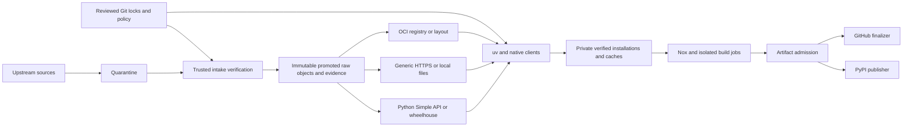

# Developer artifact architecture

## Authority map

The following paths are the selected *implementation contract*, not files
claimed to exist already. New authority lives in `implementations/`, `docs/`
or existing approved authority roots. Nothing in this design makes a
development record a portable SDL contract.

| Authority | Selected location / representation | Owner and rule |
|---|---|---|
| Python resolution | Existing `implementations/python/pyproject.toml` and `uv.lock` | Tooling/Security; frozen consumer use, reviewed resolution update |
| Python tool closure | `implementations/tooling/python/pyproject.toml` and `uv.lock` | Tooling; exact Nox, hooks, Ruff, schema checker and their dependencies. Entry points use this environment; no second hand-written version list |
| Build/smoke closure | `implementations/tooling/python/build-constraints.txt` and target-specific hashed exports derived from reviewed locks | Release; `uv build` uses hashed constraints, including sdist build requirements; installed smoke uses admitted dependency wheels |
| Generic input and bootstrap lock | `implementations/tooling/artifacts.lock.json` | Tooling with Security review; versioned schema, unique artifact/platform identity, reviewed raw and installed digests, exact sizes/bounds, complete dependencies |
| Client and platform policy | `implementations/tooling/profiles/` | Tooling/Platform; client versions/capabilities, context/platform support, approved locator maps, trust roots and credentials by reference, never values |
| CI executable policy | Existing `.github/workflows/*.yml` source SHAs plus `implementations/tooling/actions-policy.json` | Security/Tooling; action revision, transitive downloads, privileges and exceptions. Workflow fields that must remain literal are checked against the record |
| Revocation/admission policy | `implementations/tooling/admission-policy.json`; authenticated retained status snapshots | Security; policy version, denied digests/identities, snapshot sequence and validity, accepted signers/issuers |
| Per-run input/output evidence | Retained admission bundle in promoted storage, schema documented with tooling | Release; bind source, producer, run, locks, required inputs, output digests and decisions. A generated report is evidence, not a new version selector |
| Deployment ownership and service state | `docs/operations/package-artifacts/` and operator-controlled service configuration | Named primary/deputy, activation evidence, ACLs, quotas, retention, snapshots, restore results; secret values stay outside repository records |

The generic lock contains, per artifact: stable id; class; owner; consumers;
version; OS/architecture/ABI; exact upstream repository/release/asset identity;
raw SHA-256 and size; approved source/mirror locator identifiers; file format;
extraction member/type/size rules; installed-file digests; dependency ids;
license/redistribution decision and notice references; verification evidence
references; signature/attestation policy or explicit absence; retention class;
and supported profiles. No executable install hooks or arbitrary commands are
permitted in this data. Platform aliases normalize before selection. Missing,
duplicate or ambiguous entries are errors before network access.

Python packages are referenced through the owning lock and its hash. Do not
duplicate their resolution in the generic lock. Existing raw versus canonical
vocabulary digests remain distinct: the former binds fetched bytes, the latter
binds the semantic normalized source under its existing contract.

## Layered data flow

Public development may acquire unchanged locked bytes from approved official
origins before a promoted replica exists. This has upstream-dependent
availability, explicitly not the retained-input guarantee. Release and
qualified disconnected profiles require the complete closure in retained
storage/pre-seeded media. A cache/proxy hit is re-admitted just like a download.

## Intake and bootstrap trust

1. A protected intake job reads an exact reviewed policy revision. Candidate
   metadata is parsed as bounded data in an isolated workspace. It never runs
   an upstream installer or candidate project script with storage credentials.
2. Maintained clients fetch candidates into non-executable quarantine with
   finite time, disk and size limits. Record the logical source and identity;
   do not retain signed query strings, authorization headers or response bodies
   in diagnostics.
3. Verify archive type and bounded shape, raw digest/size, provenance/signature
   identity where required, license and redistribution eligibility, and a dated
   vulnerability decision. Record tool/policy versions and evidence digests.
4. A maintainer reviews the proposed lock change and its acquisition evidence.
   Initial trust may come from a reviewed upstream release plus independently
   authenticated signature/attestation. Where upstream provides only an unsigned
   checksum, record that limitation and the explicit review decision; never
   claim an authenticated publisher signature. Conftest/Gitleaks install-time
   checksum discovery is removed.
5. The protected promotion job rereads the merged lock and policy, verifies the
   candidate again, copies the same bytes into immutable storage, then reads
   back and verifies the destination. Only after that does it publish an
   authenticated promotion record. Content can exist before its admission
   record; that does not make it consumable by a required profile.

Trust starts at the operator's OS/vendor signing roots and a reviewed checkout
or verified Git export. The bootstrap profile qualifies the native OS's Git,
TLS CA store, curl and hash implementation. It records distro/image identity
and installed package versions; an enterprise image records its own digest and
package snapshot. These tools verify a pinned uv archive before execution.
An offline bootstrap kit includes those native prerequisites or a signed base
image containing them. A machine with neither a trusted base nor that kit
requires operator provisioning; the installer cannot manufacture its own root.

SHA-pin a setup action independently from the exact Python/uv version and
payload identity it installs. Capture interpreter implementation, version, ABI,
OS/architecture and distribution digest/source. Public hosted runner images
can change; record their image release and qualify required capabilities.
That profile makes a dependency-integrity claim, not complete host reproducibility.

Signature policy pins the issuer plus repository/workflow/source identity and
subject digest, not merely “a valid signature.” Offline verification carries
the verification bundle and its required public trust material, accepted key
ids/issuers, verification time policy and status snapshot. Key rotation is a
reviewed policy change; possession of the mirror credential cannot rotate a
trust root. Prefer short-lived OIDC for automated promotion/publication;
enterprise read credentials are scoped to approved namespaces.

## Client acquisition and local installation

`uv` owns Python resolution, HTTP and its cache. Native package managers own
their signed repository metadata and OS dependency resolution. Skopeo owns OCI
copy/export; Docker/Podman own runtime image admission. Generic raw-object
adapters invoke one qualified curl process with fixed argv and a controlled
environment. They then verify local bytes and install them. Repository code
does not read sockets or interpret HTTP status/header/framing details.

The generic-client qualification requires curl with unknown-length size
enforcement equivalent to 8.4.0 or newer and current security support; 8.4.0 is
a feature floor, not a security approval. A vendor backport needs test evidence.
Use the native distribution if it meets that profile; otherwise provision an
admitted client package through the OS/bootstrap path. Do not silently fall
back to an older curl or the Python downloader on Ubuntu 22.04.

The policy uses HTTPS-only initial/redirect protocols, no user curlrc, fixed
output path, no insecure TLS, no credential-in-URL or trusted-redirect mode,
bounded native retries and redirections, connect/transfer limits and local
disk limits. A subprocess wall deadline bounds the whole invocation because
curl's retry budget alone does not. A general CLI archive allows at most
256 MiB; Isabelle uses its exact larger pinned size and a separately qualified
budget. No generic minimum timeout is falsely applied to the 1.2 GB proof input.
The implementation records and tests budgets per class. These are native
client configuration and process supervision, not transport reimplementation.

Native retries need not reproduce #1137's original exception-by-exception
specification. The new acceptance criteria use the client's documented bounded
behavior; no `retry-all-errors` or outer retry engine is introduced to recreate
PR #1140. Availability failures may exhaust the native retry budget; integrity,
signature, archive or installed-byte failures happen outside it and stop.

Initial locators come from reviewed data. Public generic acquisition is
unauthenticated: maintained-client HTTPS redirect behavior is trusted, and
repository digests identify the content after transfer. It does **not** promise
a hostname allowlist for every redirect. Enterprise profiles enforce host egress
at the maintained proxy/firewall and prefer canonical non-redirecting mirror
URLs. This explicitly replaces PR #1140's custom redirect-host parser. Credentials
must not follow a cross-origin redirect; test the chosen client/profile and
reject a provider that cannot satisfy this.

Local installation follows these invariants:

- Key raw objects by digest, and installed trees by artifact id, platform,
  content digest and installation-policy version. Version-only paths are
  legacy inputs, not hits in the new cache.
- Use private same-filesystem staging and exclusive creation; reject symlink,
  device, escape, hardlink and unbounded archive members. Hash opened regular
  files, preserving OSV's per-use protections. Validate extracted executables
  or an entire required tree against the reviewed installed manifest.
- Serialize publication using a maintained portable lock implementation or
  platform facility. Recheck after acquiring the lock. Publish with atomic
  rename only after admission; fsync required durable files/directories.
  Another process sees either the old complete tree or the new complete tree.
- Process death leaves an unadmitted temp object, never a valid marker. Clean
  stale work only after excluding a live owner. A killed lock holder must not
  require deleting a live process's lock by guesswork.
- Reverify on use or copy admitted immutable seed content into an independently
  verified private installation. A marker/hash filename alone is insufficient.
  Tampering fails the invocation and triggers quarantine; no silent redownload
  conceals an integrity failure.

Local same-user concurrent processes are supported only after the cache tests
pass. Different users and untrusted PRs never share writable installed trees.
For high-load runners, share a root-owned read-only admitted seed and a service
cache, then give each job private environments/workspaces. Writable caches on
NFS/SMB or other filesystems without qualified lock/rename semantics are not
supported; use the service boundary and local disk instead. Administrator/host
compromise is outside the local-cache threat model.

## Operating profiles and fallback

| Profile | Inputs and credentials | Supported claim and hard failure |
|---|---|---|
| Public contributor / GitHub-hosted PR | Reviewed public origins or anonymous replica; read-only repo token only where GitHub needs it; private job cache | Linux/macOS tool subset; required hosted Linux proof. Forks receive no enterprise secret. Upstream outage can fail required work until a retained replica is provisioned |
| Local online | Same locks/clients; user-owned cache and environments | Same selected input identity as CI; local optional Docker/live lanes keep explicit skip semantics |
| Concurrent / self-hosted | Immutable shared seed, private job state, qualified native host profile; service quotas | Same-user process concurrency and isolated multi-job execution; no shared writable cross-tenant cache or fixed test resource names |
| Enterprise mirror-only | Explicit approved Simple API/generic/OCI endpoints, enterprise CA, scoped client auth | No public index/origin fallback. A private package absent from its explicit index cannot resolve from public PyPI. Missing credentials, 401/403, wrong namespace or unavailable mirror fails |
| Offline local | Pre-seeded complete target/profile closure plus current admissible status and vulnerability snapshot; client offline/no-index mode and egress denied | Run core tools/tests/docs/proof for included supported target without network; missing object yields a deterministic list before execution. Live services are reported not evaluated |
| Air-gapped site | Reviewed import bundle into local native/Python/generic/OCI stores, verified bootstrap and signed status snapshot | Clean-machine install and core verification for declared targets. Import/export never carries read/write credentials; no claim of public PyPI publication or GitHub-hosted workflow operation while disconnected |

Online public fallback order is verified local object, approved promoted
replica, approved official origin. Enterprise order is verified local object,
then the configured enterprise repository only. Disconnected order ends at
local admitted content. Locator failover is allowed only for availability
failure and the identical expected digest. The order is source selection, not
a repository retry loop: automatic failover must come from the maintained
client/provider; otherwise an operator explicitly selects an approved alternate
locator in a new invocation. Authentication denial or an integrity/revocation failure is
terminal. An operator may repair a cache in a new explicit invocation after
recording the incident, not inside an invisible fallback loop.

Python index mapping must be explicit per profile/package namespace and use
uv's conservative index behavior. Do not append a public `extra-index` as an
enterprise outage workaround. Raw local files are selected by offline profile,
not by admitting `file:` redirects from an HTTP request.

## Platform support contract

| Component | Target platform and qualification |
|---|---|
| Conftest, Gitleaks, Vale, OSV | Linux x86_64/arm64 and macOS x86_64/arm64, matching existing selectors; all four need raw/installed digests and real execution smoke before migration completion |
| Python environment | CPython 3.11, 3.12, 3.13, 3.14 within current metadata bounds; qualify available wheel/ABI closure per selected OS/architecture. 3.14t stays advisory; Windows is not a repository-tool qualification claim |
| Isabelle/proof | Linux x86_64 with qualified Bubblewrap, locale, fontconfig/fonts and process limits. macOS/arm64 contributors use a qualified Linux x86_64 host/VM; no native proof-support claim or hidden proof skip |
| OCI release input | Retain pinned multiarch index and the selected platform manifests/config/layers. Current hosted release target is Linux x86_64; arm64 needs daemon/native execution evidence before claiming an arm64 release-test profile |
| Live libvirt/AWS | Linux x86_64 host profile; KVM/QEMU/libvirt and guest-image prerequisites; separate opt-in certification, not required on ordinary contributor Macs |

Support for an interpreter or archive URL does not imply a supported host
profile. A missing wheel/native dependency is resolved during intake through
a constrained build with provenance or by declaring that profile unsupported;
it is never built opportunistically from the network during offline admission.

## State models and safety properties

| State transition | Guard / commit point | Crash or failed guard |
|---|---|---|
| Absent -> staged | Exclusive private staging, resource bounds, candidate id | Incomplete staging can be removed after owner exit; no consumer pointer |
| Staged -> verified | Raw digest, type/shape, installed tree, signature/identity and policy accepted | Quarantine; no promotion or availability failover after integrity failure |
| Verified -> promoted | Exact merged lock/policy; copy same bytes, read back digest; publish authenticated admission record last | Orphan bytes remain unadmitted. Retry compares existing bytes; no overwrite |
| Promoted -> revoked/quarantined | Authorized Security status update, monotonic sequence, timestamp and reason | Cached promotion alone no longer admits execution under a current status policy |
| Promoted -> retired -> collected | No retained supported lock/release/export references or legal/security hold; documented grace and backup | Keep referenced objects; quarantine evidence follows restricted retention |
| Cache absent -> installing -> valid | Digest/platform lock; atomic verified publication | Kill at any step yields absent or a complete verifiable installation |
| Resolved -> source-verified -> built | Exact SHA, protected verifier, required tests and OCI input succeed | Stop; skips and missing services do not manufacture a pass |
| Built -> artifact-admitted | Exact wheel/sdist smokes, corpus, SBOM/provenance and output digests bound to trusted run | Keep diagnostic evidence, no publish capability |
| Admitted -> authorized -> destination-published | Current external identity, policy/revocation and byte checks after approval, scoped producer auth | Query destination after ambiguous success; recover same bytes, never rebuild under existing version |

Safety invariants: an unreviewed digest cannot become an approved input; no
incomplete object is executable; quarantine/revocation overrides availability;
untrusted code cannot write trusted state; a release cannot publish bytes
different from those admitted; retry cannot widen identity or trust; GC cannot
remove a referenced object; an offline run cannot claim fresher status than
its imported authenticated snapshot.

Liveness is bounded, not guaranteed: required work terminates successfully or
with a classified failure within a configured job/process budget. Locks have
bounded wait and dead-owner recovery. No distributed transaction, hostile-host
protection, unlimited concurrency or automatic recovery from every provider
outage is claimed. [Acceptance tests](operations.md) exercise these properties
before an implementation profile is enabled.
