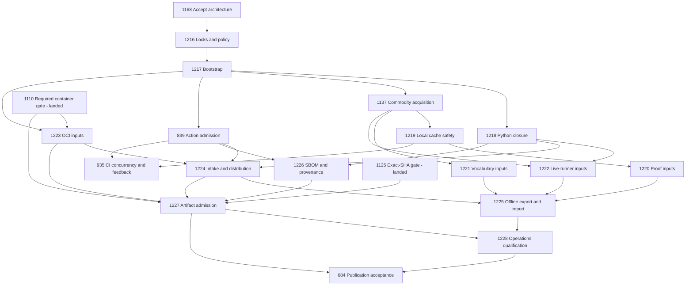

# Migration and native issue-dependency graph

## Design gate and execution rules

[Issue #1168](https://github.com/OpenRAE/rae/issues/1168) is the design gate for
[milestone 69](https://github.com/OpenRAE/rae/milestone/69). Merged PR #1229 for
issue #1168 records maintainer acceptance of ADR-106, ADR-107, and the concrete
design set. That acceptance unblocks implementation; it does not claim the
migration is already deployed.

Every open implementation issue below belongs to milestone 69 and has native
GitHub `blocked_by` relationships, including a direct #1168 gate. Edges mean
**prerequisite -> dependent**. Native relationships order repository work;
they do not technically prevent code edits or workflow execution. Maintainers
must honor design acceptance, and release jobs must enforce runtime admission
independently of GitHub issue status.

The small changes are intentionally reviewable separately: data authority,
bootstrap, network delegation, local cache safety, consumer migrations,
storage, offline export, evidence, publication and operations. None authorizes
a purchase, production deployment, package release, protected-branch merge or
feature-PR merge without the applicable user approval.

## Implementation issues and full immediate prerequisites

This table records **all immediate blockers**, including redundant direct
design/authority gates where visibility is useful. The native API is the
execution authority; update this record and GitHub together if the program
changes. Each issue body carries its own acceptance criteria and test ids from
[operations](operations.md).

| Issue | Reviewable outcome / owner | Immediate blockers |
|---|---|---|
| [#1216](https://github.com/OpenRAE/rae/issues/1216) | Reviewed input/platform locks, policy and drift checks; Tooling/Security | #1168 |
| [#1217](https://github.com/OpenRAE/rae/issues/1217) | Native bootstrap/client/host qualification; Tooling/Platform/Proof | #1168, #1216 |
| [#1218](https://github.com/OpenRAE/rae/issues/1218) | Frozen Python tool/build/smoke closure; Tooling/Release | #1168, #1216, #1217 |
| [#1137](https://github.com/OpenRAE/rae/issues/1137) | Replace four-tool transport and delete `http_download.py`; Tooling/Security | #1168, #1216, #1217 |
| [#1219](https://github.com/OpenRAE/rae/issues/1219) | Verified local installations, concurrency and crash safety; Tooling/Security | #1168, #1216, #1137 |
| [#1220](https://github.com/OpenRAE/rae/issues/1220) | Isabelle native-client/local acquisition and tree admission; Proof/Tooling | #1168, #1217, #1219 |
| [#1221](https://github.com/OpenRAE/rae/issues/1221) | Raw vocabulary snapshots through maintained clients; Semantics/Tooling | #1168, #1216, #1137 |
| [#1222](https://github.com/OpenRAE/rae/issues/1222) | VM/native/live-runner input closure; Backend/Platform | #1168, #1217, #1218, #1137 |
| [#1223](https://github.com/OpenRAE/rae/issues/1223) | OCI mirror/import with required-container identity; Backend/Release | #1168, #1216, #1217, #1110 |
| [#839](https://github.com/OpenRAE/rae/issues/839) | Action/payload/credential admission and Scorecard evidence; Security/Tooling | #1168, #1216, #1217 |
| [#1224](https://github.com/OpenRAE/rae/issues/1224) | Verified intake and immutable distribution interfaces; Platform/Tooling/Security | #1168, #1216, #1217, #1218, #1223, #839 |
| [#1225](https://github.com/OpenRAE/rae/issues/1225) | Complete disconnected export/import and preflight; Tooling/Platform/Security | #1168, #1218, #1219, #1220, #1221, #1222, #1223, #1224 |
| [#1226](https://github.com/OpenRAE/rae/issues/1226) | Output-bound SBOM and build provenance; Release/Security | #1168, #1216, #1218, #839 |
| [#1227](https://github.com/OpenRAE/rae/issues/1227) | Durable release artifact admission and byte-preserving recovery; Release/Security | #1168, #1110, #1125, #1218, #1223, #1226, #1224, #839 |
| [#1228](https://github.com/OpenRAE/rae/issues/1228) | Retention/revocation/DR/load and profile qualification; Platform/Security/Tooling/Release | #1168, #1225, #1227, #1219 |
| [#935](https://github.com/OpenRAE/rae/issues/935) | Faster concurrent CI with complete coverage and admitted inputs; Tooling | #1168, #1219, #839 |
| [#684](https://github.com/OpenRAE/rae/issues/684) | External controls and actual PyPI/GitHub consumption acceptance; Release | #1168, #1110, #1125, #1227, #1228 |

The diagram omits redundant edges for readability; the table lists the complete
immediate graph. #1110 and #1125 are closed, already shipped prerequisites in
the same milestone. They retain their historical native #1168 links and their
native blocks on #684. Do not reopen them or claim this design preceded their
implementation. New #1223/#1227 work preserves and extends their controls.

## Incumbent implementation disposition

| Inventory surface | Disposition and owning issue |
|---|---|
| I01–I04 Python project/tools/build/bootstrap | Keep uv and project resolution; #1216 authority, #1217 bootstrap, #1218 transitive/build/smoke locks. Replace uncontrolled tool/build resolution, not the Python client |
| I05–I08 generic tools | #1137 removes HTTP helper/callers and live checksum authority; #1219 governs installed cache safety. Preserve OSV's stronger controls and every existing supported platform |
| I09–I10 proof/archive/native prerequisites | #1217 qualifies host/client, #1220 removes custom transfer and marker-only admission. Keep proof sandbox and large archive identity |
| I11–I12 OCI and host runtimes | #1223 preserves landed #1110 required behavior and adds admitted mirrors/pre-seeding/concurrent resources; #1217 records host/daemon capability |
| I13 live AWS/VM setup | #1222 removes unverified VM downloads, suppressed failures, pipe-to-shell bootstrap and unfrozen native/Python setup; no rewrite of AWS API orchestration |
| I14 vocabulary remote sources | #1221 replaces network paths, retains canonical semantic checks and records raw source closure |
| I15 checked-in styles/corpus | Retain reviewed Git sources, source closure via #1216 and output membership via #1218/#1227. No external style service is introduced |
| I16 and A01–A07 source/actions/workflows/apps | #1216/#1217/#839 govern executable inputs and transitive acquisition; platform-managed apps remain explicitly external; #935 covers concurrent CI integration |
| O01 release distributions | #1218 constrains builds/smokes; #1227 admits exact output bytes; #684 tests real consumers |
| O02 missing SBOM/provenance | #1226 adds generation and subject binding; #1227/#1228 retain/admit them |
| O03 Releases/PyPI | Retain release-please, #1110/#1125, OIDC and separate jobs; #1227 removes overwrite recovery and expiring-artifact dependence; #684 finishes external setup/consumption |
| O04 docs delivery | Keep Pages/RTD/Sphinx; #1217/#1218/#839 qualify build/client/action inputs. Site artifacts stay derived delivery output, not a package repository |
| C01–C02 tool/Python/proof caches | Native uv cache maintenance; #1219/#1220 verified installations and immutable seeds; #1225 raw-object export instead of cache copying |
| C03 reports | #935 preserves complete coverage handoff; #1226/#1227 distinguish ephemeral diagnostics from retained release evidence; #1228 retention |
| C04 image/test/cloud scratch | #1223/#1222 isolate runtime resources; #1228 GC/capacity; runtime module caches remain in their domain |
| S01 security data | #1225/#1228 govern dated offline database/status exports and freshness; binary digest never claims up-to-date vulnerability knowledge |
| S02 live APIs | Retain services and owners; #1225 explicitly reports them unevaluated offline. HTTP used for non-acquisition governance/runtime APIs is outside the production acquisition prohibition |
| D01 runtime-domain packages/modules | Excluded from this migration. Separate authorities and storage namespaces; no development installer may reuse the runtime OCI HTTP resolver |

`tools/http_download.py` is deleted by #1137. Isabelle's HTTP imports and
download/fallback implementation are removed by #1220. Vocabulary remote fetch
code is removed by #1221. Live-runner scripts use maintained clients already
but their unsafe bootstrap/identity/failure behavior is replaced in #1222.
The final #1228 audit checks imports, call sites, subprocess clients, shell
scripts, workflow actions and setup instructions. It cannot pass merely
because one filename disappeared.

PR [#1140](https://github.com/OpenRAE/rae/pull/1140) was closed without merging.
Its custom `release_download.py`, low-level socket/framing/redirect/retry code
and compatibility transport facade are rejected. Installer integrity test
cases may inform acceptance tests when they exercise the retained contract;
tests devoted to preserving its protocol implementation must not be carried
forward. This is a recorded disposition, not a request to close or merge that PR.

## Existing issue scope audit

The complete open-issue title list and the relevant issue bodies were reviewed
for development/acquisition/publication scope on 2026-09-05. Existing open
#1137, #839 and #684 already belonged to
milestone 69 and had native #1168 blockers. Their bodies now reflect the
architecture and current repository state. #935 is moved into this milestone
and blocked on the design, concurrent cache admission and action policy because
its CI shards share inputs and coverage artifacts; its original coverage and
latency acceptance criteria are preserved.

Other nearby work stays in its own scope:

- #1021 and #1023 are repository/product identity migrations. Current canonical
  repository/distribution identity is already OpenRAE/rae and `raes`; #684 owns
  verification of publisher/endpoint identity at publication. Their broader
  rename/docs/app work does not depend on installing a package client.
- #1144 governs PR bodies/closing-issue audits, not acquisition. It remains an
  independent policy check. #1167 is general status-prose reconciliation.
- #974–#976 concern proof-model checking/reproduction/documentation, not the
  delivery mechanism of the already selected Isabelle input. #1220 owns that
  mechanism. A later new proof tool must enter #1216's policy before use.
- #717 concerns live backend certification. Its input tooling is covered by
  #1222; workload semantics and certification acceptance remain independent.
- #1202, #1205, #1208 and other scenario/runtime/profile publication issues are
  domain artifacts under D01, not developer-package implementation issues.
- #954/#949 and env-pack companion boundaries concern downstream domain/content
  publication; no shared developer integrity authority is assumed.
- #648 (Packaging & Supply Chain program), #1110, #1125 and #1134 are closed
  historical/completed work. Existing accepted behavior is preserved; only
  #1110/#1125 supply direct release prerequisites in this graph.

## Cutover, rollback and final acceptance

Land locks and bootstrap qualification before migrating a consumer. Then
replace each old path in its owning issue; do not add a second transport and
leave the old one as an implicit fallback. At each cutover, run the owning
tests against current pinned bytes plus deliberate corrupt/missing inputs.
Cold/warm, pre-seeded and concurrent behavior must be distinguishable in
evidence. New local cache namespaces do not overwrite unrelated user state;
legacy entries can be imported only after full verification.

Client rollback selects a previous *admissible* native client/profile or
read-only seed, keeping reviewed hashes and required tests. It cannot restore
custom HTTP, live checksum selection, a revoked digest, an untrusted cache or
mutable release publication. Storage rollback restores original immutable
bytes and authenticated records. Publication rollback follows ADR-107's
destination-query/same-byte recovery, never deleting/replacing a live version
to conceal a mismatch.

#1228 closes only with the operations matrix and complete acquisition audit.
#684 then records authorized end-to-end release consumption. The milestone
finishes only when all its implementation issues, including #935, meet their
own acceptance criteria. Design completion needs no release or production
deployment and must not mark those later guarantees as delivered.

To audit native edges, use GitHub's issue-dependency API for each table row:
`GET /repos/OpenRAE/rae/issues/{number}/dependencies/blocked_by`, and verify
the reverse `blocking` lists, issue states and milestone numbers. Compute
acyclicity and compare the complete expected edge set, not only prose matches.
The [GitHub API](https://docs.github.com/en/rest/issues/issue-dependencies)
uses the blocking issue's numeric **id** when creating an edge, which is
distinct from its visible issue number.
