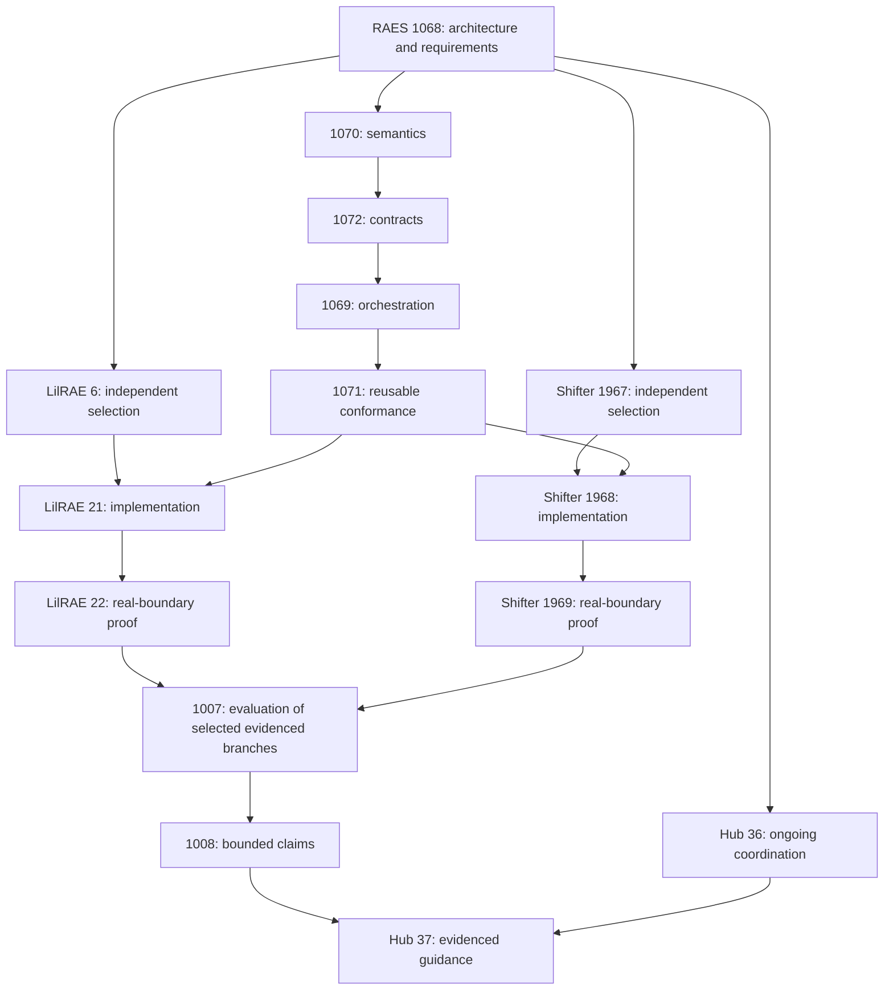

# Dependency-ordered delivery

This is the architecture handoff for [#1068](https://github.com/OpenRAE/rae/issues/1068),
revision 1. [delivery.json](delivery.json) records the same node identities,
requirements, AND/OR dependencies and conditional claim gates for mechanical
checking. Hub [#36](https://github.com/OpenRAE/hub/issues/36) owns ongoing
cross-repository coordination; this design snapshot does not replace it.
All 14 child/consumer issues were inspected and open on 2026-09-06.

The two incoming backend edges to evaluation mean **one or more selected,
completed branches**, not a requirement that both backends ship or match.
Every additional backend claim requires its own exact evidence. The machine
record's `requires_any` is a list of alternative groups: satisfy at least one
member of each group, as well as every `requires_all` dependency. Conditional
adversarial guidance requires #1007/#1008; general executable guidance requires
only the relevant released semantics/runtime and backend proof. Hub #36 is a
coordination snapshot, not a barrier that waits for #1008 before updating it.

## Work packages and completion evidence

| Issue | Authority | Prerequisites and concrete exit evidence |
| --- | --- | --- |
| [RAES #1070](https://github.com/OpenRAE/rae/issues/1070) | SEM-235; reuse SEM-230/233 | Accepted #1068. Publish PC-01–PC-15 formal meaning, domains and laws, closed concept-authority/lineage mappings, non-security/security examples and counterexamples. |
| [RAES #1072](https://github.com/OpenRAE/rae/issues/1072) | API-424; API-407/409/423 | #1070. Publish provider protocol and closed selection/result/composition/effect bindings, schemas/ledger, valid and invalid fixtures, compatible legacy SEM-233 handling. |
| [RAES #1069](https://github.com/OpenRAE/rae/issues/1069) | RUN-320; RUN-319/310, API-404 | #1072. Replace implicit resolver hook; exercise multiple providers/profiles, inject and non-inject effects, failed commits, concurrency, finite triggers, both stores and external uncertainty at real runtime sinks. |
| [RAES #1071](https://github.com/OpenRAE/rae/issues/1071) | ASR-538; ASR-535 | #1069. Release independently runnable conformance with positive/negative and dishonest declaration cases. Synthetic providers establish corpus/runtime behavior only, so this release need not wait on production backend implementation. |
| [LilRAE #6](https://github.com/OpenRAE/lilrae/issues/6) | Consume SEM-235/API-424/ASR-538; select local authority | #1068; existing APTL inventory remains an input. Accept personal/local mechanism, instrumentation, installation, capability, recovery and external integrity choices. Name local requirement ownership before #21. No Shifter parity condition. |
| [Shifter #1967](https://github.com/Brad-Edwards/shifter/issues/1967) | Consume SEM-235/API-424/ASR-538; select local authority | #1068. Accept independently selected organizational mechanism/service boundaries, generations, audit/readback, deployment and integrity envelope; name local requirement ownership before #1968. No LilRAE parity condition. |
| [LilRAE #21](https://github.com/OpenRAE/lilrae/issues/21) | API-424/RUN-320/ASR-538 and accepted local mapping | #6 and released #1070/#1072/#1069/#1071. Install and instrument selected real mechanisms, preserving all bindings, capability posture, governed effects and failure semantics. |
| [Shifter #1968](https://github.com/Brad-Edwards/shifter/issues/1968) | API-424/RUN-320/ASR-538 and accepted local mapping | #1967 and the same RAES release prerequisites. Realize selected mechanisms through existing authenticated, authorized, generation-fenced service paths with readback. |
| [LilRAE #22](https://github.com/OpenRAE/lilrae/issues/22) | ASR-538 and local realization authority | #21, #6, #1071. Installed-artifact real-boundary proof, selected permissive/strict/trigger cases, native readback, restart/memory/failure and released conformance evidence. |
| [Shifter #1969](https://github.com/Brad-Edwards/shifter/issues/1969) | ASR-538 and local realization authority | #1968, #1967, #1071. Installed service/participant/world proof, isolation/generation/recovery and exact conformance/native evidence agreement. |
| [RAES #1007](https://github.com/OpenRAE/rae/issues/1007) | Amended ASR-536; SEM-233/235, ASR-535/538 | Completed core plus at least one selected proof branch. Revisioned honest/attack experiments, knowledge/collusion/budget variables, real supported effects, safety/usefulness/cost/uncertainty and replayable evidence. |
| [RAES #1008](https://github.com/OpenRAE/rae/issues/1008) | ASR-536/535/538, SEM-233/235 | #1007 and every proof branch used by its claims. Publish exact scientific-completeness, assurance, lineage and public-doc claims, limitations and nonclaims; keep Hub #36 current. |
| [Hub #36](https://github.com/OpenRAE/hub/issues/36) | Coordination only; reference RAES UIDs | Begin from #1068 and track each release and selected backend independently. Reflect the actual dependency/evidence state; no copied runtime or semantic authority. |
| [Hub #37](https://github.com/OpenRAE/hub/issues/37) | Documentation consumer of exact RAES/backend authority | Current #36, released core and at least one proof branch before executable guidance. #1007/#1008 additionally gate adversarial claims. Provide reusable guidance for Hub #15's wider research walkthrough. |

## Integration and migration gates

The first gate is the merged design/requirement revision, not the existence of
a URL in an issue body. Backend selection can run alongside RAES semantic and
contract work once that gate is passed. Implementation consumes published
versions; private copies of the proposed protocol do not satisfy dependencies.
No implementation node loses its block merely because its governing UID is
now listed. Native backend requirements are decided with native mechanisms,
not invented here to preselect an engine.

#1072/#1069 must explicitly preserve or negotiate the old security profile and
opt-in resolver behavior. A runtime without the new protocol does not claim
modular orchestration; historical capability and final-sink evidence keep their
original scope. No published schema is changed by #1068.

Cross-repository requirements name the **OpenRAE/rae** authority and exact
revision; an identically spelled backend-local UID is not interchangeable.
Issue completion, package release, installed artifact, realized behavior,
bounded conformance and evaluated claims are separate evidence coordinates.

## Existing foundations and exclusions

Closed RAES #1001–#1004 and design #794/#812 are incumbent inputs. Wider backend
migration/packaging prerequisites already present in LilRAE #6 or Shifter's
native program remain intact. Hub #15 is a downstream use of #37 content, not
an additional blocker for RAES semantics. This program implements no engine,
plugin host, backend or evaluation inside #1068 and creates no duplicate issues.
