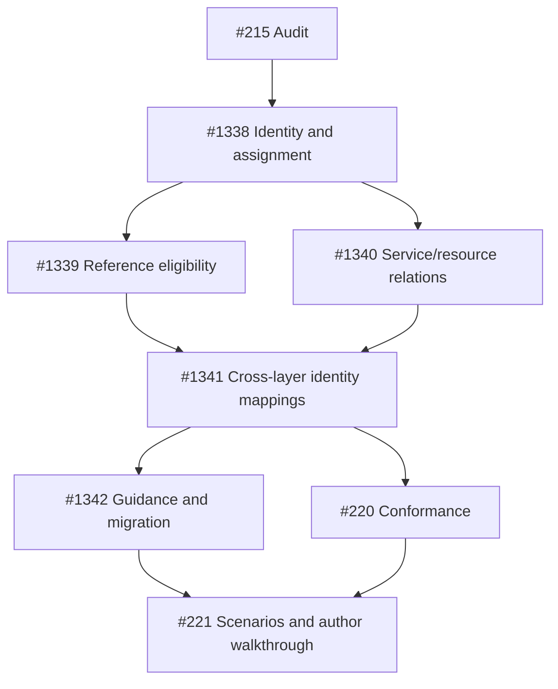

# Participant identity remediation ownership

This is the actionable backlog for [audit #215](https://github.com/OpenRAE/rae/issues/215).
The [audit](audit.md) and [evidence](evidence.md) describe observed behavior;
the issues below own semantic decisions, implementation and compatibility.
All seven implementation owners are in
[milestone 60 — Runtime & Participant Model](https://github.com/OpenRAE/rae/milestone/60).
Publishing this audit does not implement ACT-613 or close these owners.

## Findings and owners

| Work package | Findings | Implementation owner | Concrete result |
| --- | --- | --- | --- |
| P1 | F1 identity/affiliation; F2 objective actors | [#1338](https://github.com/OpenRAE/rae/issues/1338) | Separate authored identity, affiliation/role, objective owner, assignment and acting; implement reviewed migration |
| P2 | F4 reference-purpose policy; F5 editor mismatch | [#1339](https://github.com/OpenRAE/rae/issues/1339) | Intentional eligibility for each declaration/reference purpose; consistent parser, compiler and editor treatment |
| P3 | F3 service/participant/resource relation | [#1340](https://github.com/OpenRAE/rae/issues/1340) | Resolve optional relation semantics without automatic participation or compulsory component/deployment graphs |
| P4 | F6 address scope and joining | [#1341](https://github.com/OpenRAE/rae/issues/1341) | Classify authored, compiled and opaque identities; enforce required joins and preserve historical evidence |
| P5 | F7 current/historical guidance | [#1342](https://github.com/OpenRAE/rae/issues/1342) | Current field/concept crosswalk, discoverable ADR-079 migration and coherent author guidance after P1–P4 |
| Existing conformance owner | Verification of P1–P4 | [#220](https://github.com/OpenRAE/rae/issues/220) | Negative and cross-stage identity, eligibility, address and authority-binding cases |
| Existing scenario owner | Author tasks and integrated delivery | [#221](https://github.com/OpenRAE/rae/issues/221) | Composite/shared-identity/service/actor-target/import/swap scenarios and a bounded adoptability walkthrough |

Every issue states the semantic problem, intended result, affected surfaces,
acceptance examples and counterexamples, compatibility implications and
verification. #220 and #221 retain their original bodies and ownership, with a
scoped audit addendum. #343/#344/#345 retain manifest, apparatus-conformance and
provenance ownership; P4 reuses those artifacts for its cross-layer joins.
#257 remains the broader multi-role assurance owner. No duplicate general
manifest, runtime, conformance or scenario program was created.

F3's apparatus/resource separation and F6's author-to-compiler mapping are
intentional differences to preserve, not defects to erase. Their unresolved
relation/join questions remain assigned to P3/P4. F7's old-field diagnosis is
resolved by ADR-079; P5 owns discoverability and adjacent consistency. No
finding is left as an ownerless note.

## Native dependency order

An arrow means **prerequisite blocks dependent**, not checklist containment.
These edges use the GitHub issue-dependencies API; issue hyperlinks alone are
not the enforcement mechanism.

| Prerequisite | Dependent | Reason |
| --- | --- | --- |
| #215 | #1338 | Evidence and constraints precede selected identity changes |
| #1338 | #1339 | Purpose rules need actor/owner and participant identity meanings |
| #1338 | #1340 | Resource relations need a stable participant identity boundary |
| #1339 | #1341 | Address bindings must preserve selected reference purposes |
| #1340 | #1341 | Resource/participant joining must follow the approved relation |
| #1341 | #1342 | Current guidance must describe resolved mappings and prior decisions |
| #1341 | #220 | Integration conformance needs the implemented identity/reference/service joins |
| #1342 | #221 | Representative author scenarios need current guidance and migration routes |
| #220 | #221 | Scenario claims need the conformance cases they rely on |

P2 and P3 can proceed independently after P1. P5 and conformance can proceed
independently after P4. The audit has no dependency on completing its own
remediation, avoiding a delivery deadlock.

## Dependency and publication verification

Verified 2026-09-21 using the
[GitHub issue-dependencies API](https://docs.github.com/en/rest/issues/issue-dependencies).
For prerequisite A and dependent B, writes addressed B's `dependencies/blocked_by`
endpoint using A's numeric issue **id**, not its issue number. Reads paginated
both `blocked_by` and `blocking`.

The verification traversed both directions from every affected issue to include
pre-existing edges in the connected graph, checked the proposed union for cycles
before writing, and then re-read and checked the graph after writing. All nine
edges above were present in both directions. The affected component contained
eight issues and nine edges, with no pre-existing edges and no cycles. One valid
topological order is #215, #1338, #1340, #1339, #1341, #1342, #220, #221.
These are observations at publication time, not a promise that GitHub state
cannot later change.

Issue body/title round trips and milestone 60 membership were checked for
#1338–#1342; the appended bodies and milestone membership were checked for
#220/#221. The audit's issue-thread publication links this document and every
owner. Repository publication checks cover local links, whitespace and file-local
policy, followed by the required review, publish hook, CI/Sonar and readiness
record on #215. Their workflow records, rather than this audit, are the authority
for whether the delivery PR is ready to merge.

## Completion boundaries

The audit acceptance criteria map as follows:

| #215 criterion | Deliverable or verification |
| --- | --- |
| Author-designated autonomy, composite identity, participant-only semantics, actor and target roles | Audit governing meaning, F1–F6, P1–P4 acceptance/counterexamples |
| All five audit questions | F1/F2 identity and objectives; F3 services; F4/F5 reference purposes; F6 names/joins; F7 drift |
| Primary sources, lineage, relevance/limits and alternatives | research.md and the audit's alternatives and author-task tables |
| Every finding resolved or assigned | Findings/owners table above, including intentional differences and open questions |
| Actionable implementation issues in milestone 60 | Five new owners, two existing owners with scoped acceptance addenda, API readback |
| Real dependencies with verified direction and no cycles | Nine native edges, both-direction readback and transitive graph verification |
| Audit, owners and order linked from #215 | Issue-thread publication plus repository docs index |

Only implementation owners change language/runtime contracts. They must use the
existing schema publication and compatibility machinery, preserve accepted-ADR
history, keep caller authorization distinct from participant identity, and
test actual behavior. Corpus completion is the point to reassess ACT-613's
complete delivery evidence; no status promotion follows from this audit.
